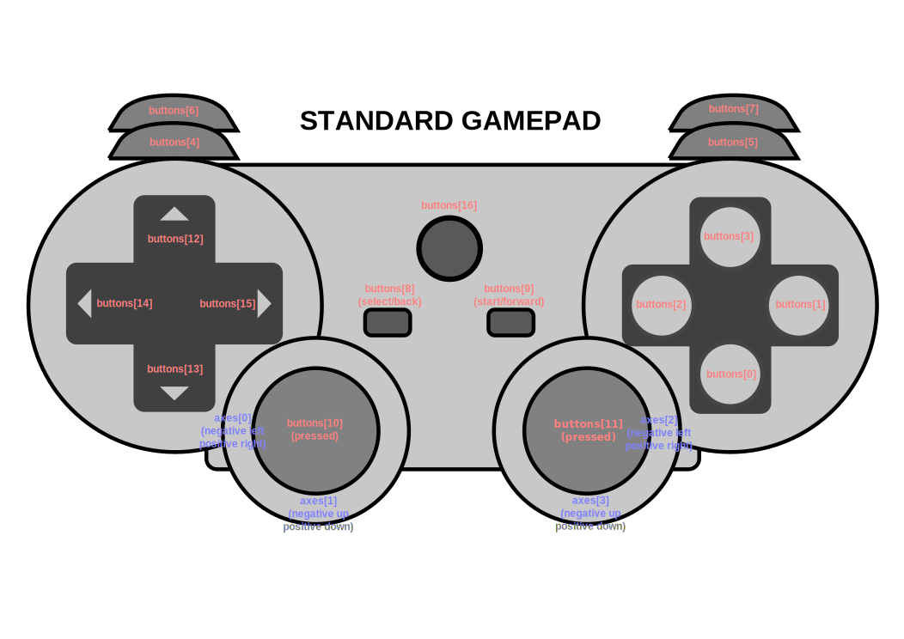

## Introduction

This Emscripten/webassembly port of GLFW tries to implement as much of the GLFW API that is possible to implement 
in the context of a web browser.
See the list of [all functions](#glfw-functions) with some notes for details.
This page documents the most important aspects of the library.

## Main concept

This port, as well as other library ports (like [SDL](https://github.com/libsdl-org/SDL/blob/main/docs/README-emscripten.md)), associates the concept of a "window" (in this instance 
a `GLFWwindow`) to an HTML "canvas". The framebuffer size of the window is the size of the canvas 
(`canvas.width` x `canvas.height`) and this is what you use for your viewport.
The size of the window is the CSS style size of the canvas (which in the case of Hi DPI is different). The opacity
is the CSS style `opacity`, etc...

> [!IMPORTANT]
> Once the canvas is associated with the window, the library takes control over it and sets various listeners and
> CSS styles on the canvas.
> In particular, the width and height are controlled by the library and as a result this implementation offers another 
> mechanism for the user to be able to resize the canvas.

### How to associate the window with the canvas?

Natively, GLFW doesn't know anything about the concept of a canvas. So there needs to be a way to make this association.
This library offers 2 ways depending on your needs:

#### 1. Using JavaScript/Module

Every Emscripten application needs to define a `Module` variable in JavaScript (see [example](https://github.com/emscripten-core/emscripten/blob/900aee0a2df98b28579d72b17f6fa73e48087e69/src/shell.html#L37)).
By convention in Emscripten, the `Module["canvas"]` field represents the canvas associated to the window.
To be backward compatible with this option, this library supports it, and it is the default. Obviously, this can only
work if there is only one window, which is why there is another method.

#### 2. Using `emscripten::glfw3::SetNextWindowCanvasSelector`

This implementation offers an alternative way of specifying which canvas to associate to which window: the function
`emscripten::glfw3::SetNextWindowCanvasSelector` which must be called **prior** to calling `glfwCreateWindow`. The
single argument to the function is a CSS path selector to the canvas.

Example:

```cpp
#include <GLFW/emscripten_glfw3.h> // contains the definitions

emscripten::glfw3::SetNextWindowCanvasSelector("#canvas1");
auto window1 = glfwCreateWindow(300, 200, "hello world", nullptr, nullptr);
```

This function is required if you use more than one window since the `Module` solution only supports 1 canvas.
It also offers the advantage of defining the association in C/C++ as opposed to HTML/JavaScript.

### How to make the canvas resizable by the user?

GLFW deals with windows. Windows, in the context of a desktop application, are usually resizable by the user (note that
the GLFW window hint/attribute `GLFW_RESIZABLE` lets you disable this feature). So how does this translate into the
HTML/canvas world?

To make the canvas resizable, and behave more like a "traditional" window, this implementation offers a
convenient API: `emscripten::glfw3::MakeCanvasResizable`:

```cpp
int MakeCanvasResizable(GLFWwindow *window,
                        std::string_view canvasResizeSelector,
                        std::optional<std::string_view> handleSelector = std::nullopt);
```

Since this library takes control of the canvas size, the idea behind this function is to specify which
other (HTML) element dictates the size of the canvas. The parameter `canvasResizeSelector` defines the
(CSS path) selector to this element.

The 3 typical use cases are:

#### 1. Full window

The canvas fills the entire browser window, in which case the parameter `canvasResizeSelector` should simply
be set to "window" and the `handleSelector` is `std::nullopt`.
This use case can be found in application like ImGui where the canvas is the window.

Example code:

```html
<!-- html -->
<canvas id="canvas1"></canvas>
```

```cpp
// cpp
emscripten::glfw3::SetNextWindowCanvasSelector("#canvas1");
auto window = glfwCreateWindow(300, 200, "hello world", nullptr, nullptr);
emscripten::glfw3::MakeCanvasResizable(window, "window");
```

#### 2. Container (`div`)

The canvas is inside a `div`, in which case the `div` acts as a "container" and the `div` size is defined by
CSS rules, like for example: `width: 75vw` so that when the page/browser gets resized, the `div` is resized
automatically, which then triggers the canvas to be resized. In this case, the parameter `canvasResizeSelector`
is the (CSS path) selector to this `div` and `handleSelector` is `std::nullopt`.

Example code:

```html
<!-- html -->
<style>
  #canvas1-container {
    width: 75vw;
    height: 50vh;
  }
</style>
<div id="canvas1-container">
  <canvas id="canvas1"></canvas>
</div>
```

```cpp
// cpp
emscripten::glfw3::SetNextWindowCanvasSelector("#canvas1");
auto window = glfwCreateWindow(300, 200, "hello world", nullptr, nullptr);
emscripten::glfw3::MakeCanvasResizable(window, "#canvas1-container");
```

#### 3. Container + handle

Same as 2. but the `div` is made resizable dynamically via a little "handle" (which ends up behaving like a
normal desktop window).

Example code:

```html
<!-- html -->
<style>
  #canvas1-container {
    position: relative;
  <!-- . . . -->
  }

  #canvas1-handle {
    position: absolute;
    bottom: 0;
    right: 0;
    margin-bottom: 1px;
    margin-right: 1px;
    border-left: 20px solid transparent;
    border-bottom: 20px solid rgba(102, 102, 102, 0.5);
    width: 0;
    height: 0;
    cursor: nwse-resize;
    z-index: 1;
  }
</style>
<div id="canvas1-container">
  <div id="canvas1-handle" class="handle"></div>
  <canvas id="canvas1"></canvas>
</div>
```

```cpp
// cpp
emscripten::glfw3::SetNextWindowCanvasSelector("#canvas1");
auto window = glfwCreateWindow(300, 200, "hello world", nullptr, nullptr);
emscripten::glfw3::MakeCanvasResizable(window, "#canvas1-container", "canvas1-handle");
```

> [!TIP]
> If you do not want the canvas to be resizable by the user, you can simply set its size during window creation
> (`glfwCreateWindow`) or with `glfwSetWindowSize` and don't do anything else.

## Fullscreen support

GLFW has a concept of a fullscreen window.
This is quite tricky for this implementation due to the restrictions imposed by browsers to go fullscreen.
Historically, Emscripten has offered a way to do it from JavaScript by the means of a
function that gets added automatically to the `Module` called `requestFullscreen`.

This implementation adds another JavaScript function `Module.glfwRequestFullscreen(target, lockPointer, resizeCanvas)`
with

* `target` being which canvas need to be fullscreen
* `lockPointer`: boolean to enable/disable grabbing the mouse pointer (equivalent to
  calling `glfwSetInputMode(GLFW_CURSOR, xxx)`)
* `resizeCanvas`: boolean to resize (or not) the canvas to the fullscreen size

To be backward compatible with the current Emscripten/GLFW/JavaScript implementation, you can also call
`Module.requestFullscreen(lockPointer, resizeCanvas)` and the library does its best to determine which
canvas to target.

This implementation also offers a CPP and C version of this API:

```cpp
void emscripten::glfw3::RequestFullscreen(GLFWwindow *window, bool lockPointer, bool resizeCanvas);
void emscripten_glfw_request_fullscreen(GLFWwindow *window, bool lockPointer, bool resizeCanvas);
```

> [!TIP]
> To avoid any error while switching to fullscreen, you should always trigger this api from within a user event
> like a mouse click (callback set via `glfwSetMouseButtonCallback`)
> or a keyboard key press (callback set via `glfwSetKeyCallback`)

At this moment, this implementation does not support creating a window in fullscreen mode due to the same browser
restrictions mentioned previously. If you want to create a fullscreen window, create a window with a fixed size,
then from a user event call `Module.glfwRequestFullscreen`.

## Hi DPI support

This implementation supports Hi DPI awareness. What this means is that if the browser window is on a screen that is
Hi DPI/4k, then it will properly adjust the dimension of the canvas to match the scale of the screen. If the window gets
moved to a screen that is lower resolution, it will automatically change the scaling. You can set a callback to be
notified of the changes (`glfwSetWindowContentScaleCallback`) or call the direct API `glfwGetWindowContentScale`.

By default, this feature is enabled and can be turned off like this:

```cpp
// before creating a window (to turn Hi DPI Awareness OFF)
glfwWindowHint(GLFW_SCALE_FRAMEBUFFER, GLFW_FALSE);
auto window = glfwCreateWindow(...);

// after window creation, it can be dynamically changed
glfwSetWindowAttrib(window, GLFW_SCALE_FRAMEBUFFER, GLFW_TRUE); // for enabling Hi DPI awareness
glfwSetWindowAttrib(window, GLFW_SCALE_FRAMEBUFFER, GLFW_FALSE); // for disabling Hi DPI awareness
```

> [!NOTE]
> The constant `GLFW_SCALE_FRAMEBUFFER` was introduced in GLFW 3.4. The constant `GLFW_SCALE_TO_MONITOR` which was 
> used prior to GLFW 3.4, can still be used to trigger Hi DPI Awareness, but is less descriptive and as a result it 
> is deprecated, and it is preferable to use `GLFW_SCALE_FRAMEBUFFER`.


> [!TIP]
> Almost all GLFW apis deal with screen coordinates which are independent of scaling.
> The only one that doesn't is `glfwGetFramebufferSize`
> which returns the actual size of the surface which takes into account the scaling factor.
> As a result, for most low-level APIs (like OpenGL/webgl) you would use this call to set the viewport size.
>
> Here is an example:
> ```cpp
> int width = 0, height = 0;
> glfwGetFramebufferSize(fWindow, &width, &height);
> glViewport(0, 0, width, height);
> ```

## Keyboard support

This implementation supports the keyboard and uses the same mapping defined in Emscripten for scancodes. You can check
[KeyboardMapping.h](../src/cpp/emscripten/glfw3/KeyboardMapping.h) for the full mapping. This implementation uses `KeyboardEvent.key` to compute an accurate
codepoint (provided to the `GLFWcharfun` callback) and not the deprecated  `KeyboardEvent.charcode` like other
implementations.

Internally, the library uses the keyboard events provided by JavaScript and calls `e.preventDefault()` on all 
keyboard events except for the 3 keyboard shortcuts associated with cut, copy and paste (based on the runtime platform:
&#x2318; + C, &#x2318; + X + &#x2318; + V, for macOS and ^ + C, ^ + X, ^ + V for the other platforms).

In particular, this allows an application written using this library to automatically ignore ^ + F (resp. &#x2318; + F) 
which displays a "Find in page" interface, which is usually not desirable nor useful (a canvas is not searchable).

In the event you want to change this behavior, you can add your own callback by calling 
`emscripten::glfw3::AddBrowserKeyCallback()` or entirely replace it with `emscripten::glfw3::SetBrowserKeyCallback()`.
The callback is called on key down, key repeat and key up and should return `true` for the event to bubble up to 
the browser (`e.preventDefault()` will **not** be called).

Here is an example:

```cpp
// Allow the F12 key to bubble up to the browser (open developer tools in Chrome):
emscripten::glfw3::AddBrowserKeyCallback([](GLFWwindow* window, int key, int scancode, int action, int mods) {
  return mods == 0 && action == GLFW_PRESS && key == GLFW_KEY_F12;
});
```

> [!NOTE]
> At this time, `GLFW_MOD_CAPS_LOCK` and `GLFW_MOD_NUM_LOCK` are **not** supported.


### The problem of the "Super" key

The key called "Super" by the GLFW library (also known as Meta or Command) exhibits an issue in the context of the
browser: pressing any other regular key (like the key `A`) while "Super" is being held, properly triggers down and
repeat events, but never triggers the up event.

This library implements a workaround to detect this scenario by setting internal timeouts.
These values can be read and modified via the `emscripten::glfw3::GetSuperPlusKeyTimeouts()` and 
`emscripten::glfw3::SetSuperPlusKeyTimeouts()` APIs.

In addition to timeouts, when the "Super" key is released, all keys are also released.

> [!TIP]
> It is strongly recommended for your application to set a key callback (`glfwSetKeyCallback`) since you get
> notifications on key down and key repeat, based on the values set at the OS level instead of trying to implement
> key repeat manually.

## Joystick/Gamepad support

This implementation uses the JavaScript `Gamepad` API as defined in the [specification](https://w3c.github.io/gamepad/)
which is widely supported by most current browsers.

> [!IMPORTANT]
> Due to the nature of the `Gamepad` API, polling is required, so you must ensure to call `glfwPollEvents` on each
> loop iteration.
>
> If you want to disable joystick support entirely (and save some resources), you can use the `disableJoystick=true`
> option if you use the port (or set the `EMSCRIPTEN_GLFW3_DISABLE_JOYSTICK` compilation define).

This [image](https://w3c.github.io/gamepad/#remapping), represents the mapping returned by this API (as defined here):



* If you use the `glfwGetJoystickAxes` and `glfwGetJoystickButtons` functions, you get exactly this mapping
* The function `glfwGetJoystickGUID` returns `Gamepad.mapping` and `glfwJoystickIsGamepad` returns `GLFW_TRUE` when the
  mapping is `"standard"`
* The function `glfwGetJoystickHats` maps the standard gamepad mapping to the `GLFW_HAT_XXX` bitfield

> [!CAUTION]
> The function `glfwGetGamepadState` returns the same information that `glfwGetJoystickAxes` and
> `glfwGetJoystickButtons` but with the mapping specified by GLFW. Although very close to the `Gamepad` mapping,
> there are differences, so make sure you use the API that suits your needs. For example
> `GLFW_GAMEPAD_BUTTON_GUIDE` is 8 but the Gamepad guide is 16!
> Example:
> ```cpp
> int count;
> auto buttons = glfwGetJoystickButtons(jid, &count);
> auto isGuidePressed = count > 16 && buttons[16];
> // versus
> GLFWgamepadstate state;
> auto isGuidePressed = glfwGetGamepadState(jid, &state) == GLFW_TRUE && state.buttons[GLFW_GAMEPAD_BUTTON_GUIDE];
> ```

## Clipboard support

In the context of the browser, getting access to the clipboard is a bit tricky as there are restrictions imposed by 
the browser for obvious security reasons.

This implementation maintains an "internal" clipboard, one that is always available whether the browser
is authorized or not to access the external clipboard.

In addition, the library registers clipboard event listeners to properly handle cut, copy and paste from outside.
What this means in practice is that if your application calls `glfwGetClipboardString`
(resp. `glfwSetClipboardString`) after detecting the same browser keyboard shortcuts for cut/copy and paste,
it simply works.

> [!TIP]
> With ImGui, you can write something like this:
> ```cpp
> ImGui::GetIO().ConfigMacOSXBehaviors = emscripten::glfw3::IsRuntimePlatformApple();
> ```

### Clipboard limitations

It is crucial to understand that `glfwGetClipboardString` does **not** access the clipboard live but simply
returns the value pasted by using the keyboard shortcut.
This limitation is due to the way the clipboard JavaScript API (`navigator.clipboard.readText`) works,
for several reasons:
- the JavaScript API is asynchronous and `glfwGetClipboardString` is not
- calling the JavaScript API results in various (purposely) intrusive popups from the browser
- these popups lead to issues (for example, Firefox shows a little "Paste" popup **every time** this API is called 
  and suppresses all keyboard events, leading to missing key up events)

As a consequence, this library does not use `navigator.clipboard.readText` and instead rely on the `paste` event.

The proper approach for your code to handle paste, is to call `glfwGetClipboardString` when the paste 
keyboard event has been detected, for example:

```cpp
void onKeyChange(GLFWwindow* window, int key, int scancode, int action, int mods) {
  static auto kActionModifier = emscripten::glfw3::IsRuntimePlatformApple() ? GLFW_MOD_SUPER : GLFW_MOD_CONTROL;
  if(action == GLFW_PRESS && (mods & kActionModifier)) {
    switch(key) {
      case GLFW_KEY_V: // paste
        auto clipboard = glfwGetClipboardString(window);
        // handle paste ....
        break;
      default:
        // ignored
        break;
    }
  }
}

// from main...
glfwSetKeyCallback(window, onKeyChange);
```

Secondly, calling `glfwSetClipboardString` first sets the internal clipboard to the value provided, then attempts
to write to the external clipboard (`navigator.clipboard.writeText`). In order for this latter call to succeed,
you should always call this API from a user-generated event. For example:

```cpp
void onKeyChange(GLFWwindow* window, int key, int scancode, int action, int mods) {
  static auto kActionModifier = emscripten::glfw3::IsRuntimePlatformApple() ? GLFW_MOD_SUPER : GLFW_MOD_CONTROL;
  if(action == GLFW_PRESS && (mods & kActionModifier)) {
    switch(key) {
      case GLFW_KEY_X: // cut
      case GLFW_KEY_C: // copy
        auto selection = "..."; // compute what is currently selected
        glfwSetClipboardString(window, selection);
        break;
      default:
        // ignored
        break;
    }
  }
}

// from main...
glfwSetKeyCallback(window, onKeyChange);
```

> [!TIP]
> Using ImGui, if you set the keyboard behavior properly, then cut/copy and paste will work as expected on 
> all platforms
> 
> ```cpp
> // during initialization
> ImGui::GetIO().ConfigMacOSXBehaviors = emscripten::glfw3::IsRuntimePlatformApple();
> 
> // loop
> ImGui::InputText("input", buffer); // cut/copy/paste work in the widget
> 
> if(ImGui::Button("Copy to clipboard"))
>   ImGui::SetClipboardText("..."); // this works as well
> 
> // Note that this will NOT work well because it bypasses the paste event and as a result
> // only the content of the internal clipboard is accessible!
> if(ImGui::MenuItem("Paste"))
>   ImGui::GetClipboardText();
> ```

## WebGL/OpenGL Support

The `GLFW_CLIENT_API` window hint dictates whether the OpenGL context is created or not
(note that this hint is set to `true` by default).

In this case, it is a WebGL context created using the Emscripten call `emscripten_webgl_create_context`.

This implementation supports the window hints: `GLFW_CONTEXT_VERSION_MAJOR` and 
`GLFW_CONTEXT_VERSION_MINOR`.

> [!TIP]
> Since Emscripten 4.0.1, when using the port, it automatically sets the Emscripten linker 
> flag `-sMAX_WEBGL_VERSION=2` to enable choosing the OpenGL version via the 
> `GLFW_CONTEXT_VERSION_MAJOR` window hint.
> Prior to Emscripten 4.0.1, you have to manually set it.

In addition, by default, the context created is set with `premultipliedAlpha=true`.

Due to the limitations with the GLFW API, if you want more control over the WebGL context created,
you can set `GLFW_CLIENT_API` to `GLFW_FALSE` and manage the context yourself:

```cpp
glfwWindowHint(GLFW_CLIENT_API, GLFW_NO_API);
EmscriptenWebGLContextAttributes attributes{};                         
// attributes.xxxx ;                                                   // configure as you wish
auto handle = emscripten_webgl_create_context("#canvas", &attributes); // to create
emscripten_webgl_make_context_current(handle);                         // to use
emscripten_webgl_destroy_context(handle);                              // to destroy
```

## Extensions

This implementation offers a few extensions to the normal GLFW api necessary for this specific platform.

### CPP extensions

As explained previously, some CPP functions are defined in `<GLFW/emscripten_glfw3.h>`

> [!NOTE]
> All functions are defined in the `emscripten::glfw3` namespace

| Function                        | Notes                                                          |
|---------------------------------|----------------------------------------------------------------|
| `SetNextWindowCanvasSelector`   | to specify the association window <-> canvas                   |
| `MakeCanvasResizable`           | to make the canvas resizable                                   |
| `UnmakeCanvasResizable`         | to revert `MakeCanvasResizable`                                |
| `IsWindowFullscreen`            | to check if the window is fullscreen                           |
| `RequestFullscreen`             | to request fullscreen                                          |
| `OpenURL`                       | to open a URL                                                  |
| `IsRuntimePlatformApple`        | to check if the platform is Apple (ex: for keyboard shortcuts) |
| `AddBrowserKeyCallback`         | to add a callback to bubble keys up                            |
| `SetBrowserKeyCallback`         | to set a callback to bubble keys up                            |
| `GetPlatformBrowserKeyCallback` | to get the default callback for the platform                   |
| `GetSuperPlusKeyTimeouts`       | to retrieve the timeouts used for the Super + key workaround   |
| `SetSuperPlusKeyTimeouts`       | to set the timeouts used for the Super + key workaround        |

### C extensions

Similar to the CPP functions, C functions are defined in `<GLFW/emscripten_glfw3.h>`, with a C-like syntax

| Function                                          | Notes                                                          |
|---------------------------------------------------|----------------------------------------------------------------|
| `emscripten_glfw_set_next_window_canvas_selector` | to specify the association window <-> canvas                   |
| `emscripten_glfw_make_canvas_resizable`           | to make the canvas resizable                                   |
| `emscripten_glfw_unmake_canvas_resizable`         | to revert `emscripten_glfw_make_canvas_resizable`              |
| `emscripten_glfw_is_window_fullscreen`            | to check if the window is fullscreen                           |
| `emscripten_glfw_request_fullscreen`              | to request fullscreen                                          |
| `emscripten_glfw_open_url`                        | to open a URL                                                  |
| `emscripten_glfw_is_runtime_platform_apple`       | to check if the platform is Apple (ex: for keyboard shortcuts) |

You can either include this file, or use an `extern "C" {}` section in your own code to define them

### JavaScript extensions

This implementation adds the following functions to the `Module`:

| Function                                                          | Notes                                                                                                                                                 |
|-------------------------------------------------------------------|-------------------------------------------------------------------------------------------------------------------------------------------------------|
| `requestFullscreen(lockPointer, resizeCanvas)`                    | Same function added by the other Emscripten implementations (for backward compatibility purposes)                                                     |
| `glfwRequestFullscreen(target, lockPointer, resizeCanvas)`        | The version specific to this implementation with the additional `target` argument (can be a canvas selector, a `HTMLCanvasElement` or a `GLFWwindow`) |
| `glfwGetWindow(any)`                                              | Returns the `GLFWwindow` pointer associated to the canvas (`any` can be a canvas selector or a `HTMLCanvasElement`)                                   |
| `glfwGetCanvas(any)`                                              | Returns the canvas associated to the window (`any` can be a canvas selector or a `GLFWwindow`)                                                        |
| `glfwGetCanvasSelector(any)`                                      | Returns the canvas selector associated to the window (`any` can be a canvas selector or a `GLFWwindow`)                                               |
| `glfwMakeCanvasResizable(any, resizableSelector, handleSelector)` | Same functionality as `MakeCanvasResizable` (`any` can be a canvas selector or a `GLFWwindow` or a `HTMLCanvasElement`                                |
| `glfwUnmakeCanvasResizable(any)`                                  | To revert `Module.glfwMakeCanvasResizable`                                                                                                            |
| `glfwIsRuntimePlatformApple()`                                    | To check if the platform is Apple (ex: for keyboard shortcuts)                                                                                        |

In addition, this implementation will check if the function `Module.glfwOnWindowCreated(glfwWindow, selector)` is
defined in which case it will be called once the window is created. This allows writing code like this:

```javascript
Module = {
  // ...
  glfwOnWindowCreated: (glfwWindow, selector) => {
    if(selector === '#canvas2') {
      Module.glfwMakeCanvasResizable(glfwWindow, '#canvas2-container');
    }
  },
  // ...
};
```

## Implementation size

This implementation being in C++ and implementing far more features than the `library_glfw.js` Emscripten
implementation, it has an impact on size.
As of initial release, I ran the following experiment on both implementations using [`example_minimal`](../examples/example_minimal)

| Mode              | `library_glfw.js`                      | This implementation                      | Delta |
|-------------------|----------------------------------------|------------------------------------------|-------|
| Debug             | js: 170775, wasm: 75789, total: 246564 | js: 99559, wasm: 4492007, total: 4591566 | 18.8x |
| Release           | js: 135433, wasm: 8448, total: 143881  | js: 81285, wasm: 80506, total: 161791    | 1.12x |
| Release (minimal) | -                                      | js: 79402, wasm: 71195, total: 150197    | 1.04x |

* From these numbers, and for obvious reasons, there is more wasm code than JavaScript code in this implementation
  (which is a good thing).
* Although the size is pretty terrible in `Debug` mode (almost a 19x size increase), in `Release`
  mode it is actually only a 12% increase which shows that wasm optimizes quite well :)
* The last entry in the table shows the same results when compiling with all _disable_ options turned on
  (`EMSCRIPTEN_GLFW3_DISABLE_JOYSTICK`, `EMSCRIPTEN_GLFW3_DISABLE_MULTI_WINDOW_SUPPORT` and
  `EMSCRIPTEN_GLFW3_DISABLE_WARNING`) for an even smaller footprint
* Lastly, `.wasm` files compress extremely well, so it is worth serving them compressed


## Implementation size (update)


```text
> cd examples/example_minimal
# using library_glfw.js
> emcc -sUSE_GLFW=3 main.cpp -O2 -o /tmp/build/index.html
# using contrib.glfw3
> emcc --use-port=contrib.glfw3 main.cpp -O2 -o /tmp/build/index.html
# using contrib.glfw3 (minimal)
> emcc --use-port=contrib.glfw3:disableWarning=true:disableJoystick=true:disableMultiWindow=true:disableWebGL2=true main.cpp -O2 -o /tmp/build/index.html
```

| Mode              | `library_glfw.js`                     | This implementation                | Delta  |
|-------------------|---------------------------------------|------------------------------------|--------|
| Release           |  js:103889, wasm:13831, total:117720  | js:59879, wasm:73001, total:132880 | 12.87% |
| Release (minimal) | -                                     | js:56724, wasm:65877, total:122601 | 4.14%  |

> [!NOTE]
> The good news is that Emscripten is improving and this implementation is benefitting from it.

## GLFW functions

This table contains the list of all the GLFW functions API and whether they are supported by this implementation 
(and the built-in implementation) with a few relevant notes

> [!NOTE]
> GLFW 3.4 introduced the concept of a platform. This implementation adds the `GLFW_PLATFORM_EMSCRIPTEN` define
> in `empscriptem-glfw3.h`: the value is reserved (in a comment), but it is not defined in `glfw3.h`.

<table>
  <tr>
    <th>Function</th>
    <th style="width:50%;"><code>emscripten-glfw</code><br>(this implementation)</th>
    <th style="width:50%;"><code>library_glfw.js</code><br>(built-in implementation)</th>
  </tr>
  <tr>
    <td>glfwCreateCursor</td>
    <td> Custom cursors are supported</td>
    <td></td>
  </tr>
  <tr>
    <td>glfwCreateStandardCursor</td>
    <td> All GLFW cursors are supported: uses the CSS style <code>cursor</code> on the canvas</td>
    <td></td>
  </tr>
  <tr>
    <td>glfwCreateWindow</td>
    <td> Support as many windows as you want: see the <a href="#how-to-associate-the-window-with-the-canvas">section</a> describing the association of a window and a canvas</td>
    <td> Support only a single window</td>
  </tr>
  <tr>
    <td>glfwDefaultWindowHints</td>
    <td></td>
    <td></td>
  </tr>
  <tr>
    <td>glfwDestroyCursor</td>
    <td></td>
    <td></td>
  </tr>
  <tr>
    <td>glfwDestroyWindow</td>
    <td> Reverts all changes (event listeners, CSS style, ...) set by this library</td>
    <td></td>
  </tr>
  <tr>
    <td>glfwExtensionSupported</td>
    <td> Same implementation as <code>library_glfw.js</code></td>
    <td></td>
  </tr>
  <tr>
    <td>glfwFocusWindow</td>
    <td> Calls JavaScript <code>HTMLElement.focus()</code> on the canvas</td>
    <td></td>
  </tr>
  <tr>
    <td>glfwGetClipboardString</td>
    <td> See the <a href="#clipboard-support">Clipboard Support section</a></td>
    <td></td>
  </tr>
  <tr>
    <td>glfwGetCurrentContext</td>
    <td> Only available if <code>glfwMakeContextCurrent</code> was called previously</td>
    <td></td>
  </tr>
  <tr>
    <td>glfwGetCursorPos</td>
    <td> Hi DPI aware</td>
    <td></td>
  </tr>
  <tr>
    <td>glfwGetError</td>
    <td></td>
    <td> 3.3.x+</td>
  </tr>
  <tr>
    <td>glfwGetFramebufferSize</td>
    <td> Hi DPI aware</td>
    <td> Hi DPI aware</td>
  </tr>
  <tr>
    <td>glfwGetGammaRamp</td>
    <td> (no access from JavaScript)</td>
    <td></td>
  </tr>
  <tr>
    <td>glfwGetGamepadName</td>
    <td> If gamepad, corresponds to <code>Gamepad.id</code> in JavaScript</td>
    <td> 3.3.x+</td>
  </tr>
  <tr>
    <td>glfwGetGamepadState</td>
    <td> If gamepad, then <code>Gamepad.axes</code> and <code>Gamepad.buttons</code> (js) remapped for GLFW</td>
    <td> 3.3.x+</td>
  </tr>
  <tr>
    <td>glfwGetInputMode</td>
    <td> Supports only <code>GLFW_CURSOR</code>, <code>GLFW_STICKY_KEYS</code> and <code>GLFW_STICKY_MOUSE_BUTTONS</code></td>
    <td> Supports only <code>GLFW_CURSOR</code></td>
  </tr>
  <tr>
    <td>glfwGetJoystickAxes</td>
    <td> Corresponds to <code>Gamepad.axes</code> in JavaScript</td>
    <td></td>
  </tr>
  <tr>
    <td>glfwGetJoystickButtons</td>
    <td> Corresponds to <code>Gamepad.buttons[x].value</code> in JavaScript</td>
    <td></td>
  </tr>
  <tr>
    <td>glfwGetJoystickGUID</td>
    <td> Corresponds to <code>Gamepad.mapping</code> in JavaScript</td>
    <td></td>
  </tr>
  <tr>
    <td>glfwGetJoystickHats</td>
    <td> If gamepad, corresponds to <code>Gamepad.buttons[x].pressed</code> in JavaScript remapped for GLFW</td>
    <td></td>
  </tr>
  <tr>
    <td>glfwGetJoystickName</td>
    <td> Corresponds to <code>Gamepad.id</code> in JavaScript (limited to 64 characters due to Emscripten limitation)</td>
    <td></td>
  </tr>
  <tr>
    <td>glfwGetJoystickUserPointer</td>
    <td></td>
    <td></td>
  </tr>
  <tr>
    <td>glfwGetKey</td>
    <td> Support <code>GLFW_STICKY_KEYS</code> as well</td>
    <td> No sticky support / Broken Meta Key</td>
  </tr>
  <tr>
    <td>glfwGetKeyName</td>
    <td> All names start with <code>DOM_PK_</code>: example, <code>DOM_PK_F1</code>.</td>
    <td></td>
  </tr>
  <tr>
    <td>glfwGetKeyScancode</td>
    <td> See <code>KeyboardMapping.h</code> for actual mapping</td>
    <td></td>
  </tr>
  <tr>
    <td>glfwGetMonitorContentScale</td>
    <td> Corresponds to <code>window.devicePixelRatio</code> in JavaScript</td>
    <td></td>
  </tr>
  <tr>
    <td>glfwGetMonitorName</td>
    <td> The constant "Browser"</td>
    <td> The constant "HTML5 WebGL Canvas"</td>
  </tr>
  <tr>
    <td>glfwGetMonitorPos</td>
    <td> Always 0/0</td>
    <td> Always 0/0</td>
  </tr>
  <tr>
    <td>glfwGetMonitorPhysicalSize</td>
    <td> (no access from JavaScript)</td>
    <td></td>
  </tr>
  <tr>
    <td>glfwGetMonitors</td>
    <td> Due to JavaScript restrictions, always only 1 monitor</td>
    <td> 1 monitor</td>
  </tr>
  <tr>
    <td>glfwGetMonitorUserPointer</td>
    <td>
    <td> 3.3.x+</td>
  </tr>
  <tr>
    <td>glfwGetMonitorWorkarea</td>
    <td> 0x0 for position, <code>screen.width</code>x<code>screen.height</code> for size</td>
    <td> 0x0 for position, <code>screen.availWidth</code>x<code>screen.availHeight</code> for size</td>
  </tr>
  <tr>
    <td>glfwGetMouseButton</td>
    <td> Support <code>GLFW_STICKY_MOUSE_BUTTONS</code> as well</td>
    <td> No sticky mouse button support</td>
  </tr>
  <tr>
    <td>glfwGetPlatform</td>
    <td> <code>GLFW_PLATFORM_EMSCRIPTEN</code> (see note above)</td>
    <td> 3.4.x+</td>
  </tr>
  <tr>
    <td>glfwGetPrimaryMonitor</td>
    <td> The single monitor returned in <code>glfwGetMonitors</code></td>
    <td> Same</td>
  </tr>
  <tr>
    <td>glfwGetProcAddress</td>
    <td> Implemented by Emscripten GL</td>
    <td> Implemented by Emscripten GL</td>
  </tr>
  <tr>
    <td>glfwGetRequiredInstanceExtensions</td>
    <td></td>
    <td></td>
  </tr>
  <tr>
    <td>glfwGetTime</td>
    <td>
    <td>
  </tr>
  <tr>
    <td>glfwGetTimerFrequency</td>
    <td> Always 1000</td>
    <td></td>
  </tr>
  <tr>
    <td>glfwGetTimerValue</td>
    <td> Corresponds to <code>performance.now()</code> in JavaScript</td>
    <td></td>
  </tr>
  <tr>
    <td>glfwGetVersion</td>
    <td>
    <td> 3.2.1</td>
  </tr>
  <tr>
    <td>glfwGetVersionString</td>
    <td> "Emscripten/WebAssembly GLFW " + GLFW version</td>
    <td> "3.2.1 JS WebGL Emscripten"</td>
  </tr>
  <tr>
    <td>glfwGetVideoMode</td>
    <td></td>
    <td></td>
  </tr>
  <tr>
    <td>glfwGetVideoModes</td>
    <td></td>
    <td></td>
  </tr>
  <tr>
    <td>glfwGetWindowAttrib</td>
    <td> Supports for
        <ul>
            <li><code>GLFW_VISIBLE</code></li>
            <li><code>GLFW_HOVERED</code></li>
            <li><code>GLFW_FOCUSED</code></li>
            <li><code>GLFW_FOCUS_ON_SHOW</code></li>
            <li><code>GLFW_SCALE_FRAMEBUFFER</code></li>
            <li><code>GLFW_SCALE_TO_MONITOR</code></li>
            <li><code>GLFW_RESIZABLE</code></li>
        </ul>
    </td>
    <td> <code>GLFW_SCALE_TO_MONITOR</code> only</td>
  </tr>
  <tr>
    <td>glfwGetWindowContentScale</td>
    <td> If HiDPI aware (<code>GLFW_SCALE_FRAMEBUFFER</code> is <code>GLFW_TRUE</code>), then current monitor scale, otherwise <code>1.0</code></td>
    <td> Similar</td>
  </tr>
  <tr>
    <td>glfwGetWindowFrameSize</td>
    <td> Because a window is a canvas in this implementation, there is no edge => all 0</td>
    <td></td>
  </tr>
  <tr>
    <td>glfwGetWindowMonitor</td>
    <td> The single monitor returned in <code>glfwGetMonitors</code></td>
    <td> Same</td>
  </tr>
  <tr>
    <td>glfwGetWindowOpacity</td>
    <td>
    <td> Always 1.0</td>
  </tr>
  <tr>
    <td>glfwGetWindowPos</td>
    <td> The position of the canvas in the page <code>getBoundingClientRect(canvas).x&y</code></td>
    <td> Whatever was set in <code>glfwSetWindowPos</code>, so not the actual position</td>
  </tr>
  <tr>
    <td>glfwGetWindowSize</td>
    <td> The size of the window/canvas</td>
    <td> Same</td>
  </tr>
  <tr>
    <td>glfwGetWindowTitle</td>
    <td> The title of the window/canvas</td>
    <td> 3.4.x</td>
  </tr>
  <tr>
    <td>glfwGetWindowUserPointer</td>
    <td>
    <td>
  </tr>
  <tr>
    <td>glfwHideWindow</td>
    <td> Set CSS property to <code>display: none</code> for the canvas</td>
    <td></td>
  </tr>
  <tr>
    <td>glfwIconifyWindow</td>
    <td></td>
    <td></td>
  </tr>
  <tr>
    <td>glfwInit</td>
    <td> Set a listener to monitor content scale change (ex: moving browser to different resolution screen)</td>
    <td>
  </tr>
  <tr>
    <td>glfwInitAllocator</td>
    <td> (due to JavaScript, memory cannot be managed)</td>
    <td> 3.4.x</td>
  </tr>
  <tr>
    <td>glfwInitHint</td>
    <td> <code>GLFW_PLATFORM</code> with value <code>GLFW_ANY_PLATFORM</code> or <code>GLFW_PLATFORM_EMSCRIPTEN</code></td>
    <td> 3.3.x</td>
  </tr>
  <tr>
    <td>glfwJoystickIsGamepad</td>
    <td> Returns <code>GLFW_TRUE</code> when the joystick mapping (<code>Gamepad.mapping</code>) is "standard"</td>
    <td></td>
  </tr>
  <tr>
    <td>glfwJoystickPresent</td>
    <td> Listens to <code>gamepadconnected</code> and <code>gamepaddisconnected</code> events to determine the presence.</td>
    <td>
  </tr>
  <tr>
    <td>glfwMakeContextCurrent</td>
    <td> Since this implementation supports multiple windows, it is important to call this if using OpenGL</td>
    <td> Since there is only 1 window, it does nothing</td>
  </tr>
  <tr>
    <td>glfwMaximizeWindow</td>
    <td></td>
    <td></td>
  </tr>
  <tr>
    <td>glfwPlatformSupported</td>
    <td> <code>GLFW_TRUE</code> for <code>GLFW_PLATFORM_EMSCRIPTEN</code> only (see note above)</td>
    <td> 3.4.x</td>
  </tr>
  <tr>
    <td>glfwPollEvents</td>
    <td> Polls for joysticks only (can be disabled with <code>disableJoystick=true</code> port option or <code>EMSCRIPTEN_GLFW3_DISABLE_JOYSTICK</code> define)</td>
    <td></td>
  </tr>
  <tr>
    <td>glfwPostEmptyEvent</td>
    <td></td>
    <td></td>
  </tr>
  <tr>
    <td>glfwRawMouseMotionSupported</td>
    <td> Always <code>GLFW_FALSE</code> (not supported)</td>
    <td> Same</td>
  </tr>
  <tr>
    <td>glfwRequestWindowAttention</td>
    <td></td>
    <td></td>
  </tr>
  <tr>
    <td>glfwRestoreWindow</td>
    <td></td>
    <td></td>
  </tr>
  <tr>
    <td>glfwSetCharCallback</td>
    <td> Uses <code>KeyboardEvent.key</code> to compute the proper codepoint. Note that `GLFW_MOD_CAPS_LOCK` and `GLFW_MOD_NUM_LOCK` are **not** supported</td>
    <td></td>
  </tr>
  <tr>
    <td>glfwSetCharModsCallback</td>
    <td> (deprecated in GLFW)</td>
    <td></td>
  </tr>
  <tr>
    <td>glfwSetClipboardString</td>
    <td> Uses <code>navigator.clipboard.writeText</code>. See the <a href="#clipboard-support">Clipboard Support section</a>.</td>
    <td></td>
  </tr>
  <tr>
    <td>glfwSetCursor</td>
    <td> Uses CSS style <code>cursor: xxx</code> for the canvas</td>
    <td></td>
  </tr>
  <tr>
    <td>glfwSetCursorEnterCallback</td>
    <td> Listeners to <code>mouseenter</code> and <code>mouseleave</code> events</td>
    <td></td>
  </tr>
  <tr>
    <td>glfwSetCursorPos</td>
    <td> (JavaScript does not allow the cursor to be positioned)</td>
    <td></td>
  </tr>
  <tr>
    <td>glfwSetCursorPosCallback</td>
    <td> Hi DPI aware</td>
    <td></td>
  </tr>
  <tr>
    <td>glfwSetDropCallback</td>
    <td> (JavaScript only gives access to filename, so it is pointless)</td>
    <td> (Copies the entire file(s) in memory)</td>
  </tr>
  <tr>
    <td>glfwSetErrorCallback</td>
    <td>
    <td> This call stores the pointer but never uses it as this implementation is not handling errors compliantly</td>
  </tr>
  <tr>
    <td>glfwSetFramebufferSizeCallback</td>
    <td> Hi DPI aware</td>
    <td> Same</td>
  </tr>
  <tr>
    <td>glfwSetGamma</td>
    <td></td>
    <td></td>
  </tr>
  <tr>
    <td>glfwSetGammaRamp</td>
    <td></td>
    <td></td>
  </tr>
  <tr>
    <td>glfwSetInputMode</td>
    <td> Supports only <code>GLFW_CURSOR</code>, <code>GLFW_STICKY_KEYS</code> and <code>GLFW_STICKY_MOUSE_BUTTONS</code></td>
    <td> Supports only <code>GLFW_CURSOR</code></td>
  </tr>
  <tr>
    <td>glfwSetJoystickCallback</td>
    <td>
    <td>
  </tr>
  <tr>
    <td>glfwSetJoystickUserPointer</td>
    <td>
    <td></td>
  </tr>
  <tr>
    <td>glfwSetKeyCallback</td>
    <td>
    <td>
  </tr>
  <tr>
    <td>glfwSetMonitorCallback</td>
    <td> Callback is never called</td>
    <td> Same</td>
  </tr>
  <tr>
    <td>glfwSetMonitorUserPointer</td>
    <td>
    <td> 3.3.x</td>
  </tr>
  <tr>
    <td>glfwSetMouseButtonCallback</td>
    <td>
    <td>
  </tr>
  <tr>
    <td>glfwSetScrollCallback</td>
    <td> Listens to <code>mousewheel</code> events</td>
    <td></td>
  </tr>
  <tr>
    <td>glfwSetTime</td>
    <td>
    <td>
  </tr>
  <tr>
    <td>glfwSetWindowAspectRatio</td>
    <td> Only works if the user is controlling the canvas size (spec does not define one way or another)</td>
    <td></td>
  </tr>
  <tr>
    <td>glfwSetWindowAttrib</td>
    <td> See <code>glfwGetWindowAttrib</code></td>
    <td> See <code>glfwGetWindowAttrib</code></td>
  </tr>
  <tr>
    <td>glfwSetWindowCloseCallback</td>
    <td> There is no concept of "closing" a canvas</td>
    <td> Called on window destroyed.</td>
  </tr>
  <tr>
    <td>glfwSetWindowContentScaleCallback</td>
    <td> Callback only called if Hi DPI aware (<code>GLFW_SCALE_FRAMEBUFFER</code> is <code>GLFW_TRUE</code>)</td>
    <td> Same</td>
  </tr>
  <tr>
    <td>glfwSetWindowFocusCallback</td>
    <td>
    <td> Callback pointer is stored but never used</td>
  </tr>
  <tr>
    <td>glfwSetWindowIcon</td>
    <td> (icon could be mapped to favicon but beyond 1.0 scope)</td>
    <td></td>
  </tr>
  <tr>
    <td>glfwSetWindowIconifyCallback</td>
    <td></td>
    <td></td>
  </tr>
  <tr>
    <td>glfwSetWindowMaximizeCallback</td>
    <td></td>
    <td></td>
  </tr>
  <tr>
    <td>glfwSetWindowMonitor</td>
    <td></td>
    <td></td>
  </tr>
  <tr>
    <td>glfwSetWindowOpacity</td>
    <td> Uses CSS style <code>opacity: xxx</code> for the canvas</td>
    <td></td>
  </tr>
  <tr>
    <td>glfwSetWindowPos</td>
    <td> (there is no generic way to set a canvas position)</td>
    <td></td>
  </tr>
  <tr>
    <td>glfwSetWindowPosCallback</td>
    <td> Uses top/left of the value returned by <code>getBoundingClientRect(canvas)</code>)</td>
    <td></td>
  </tr>
  <tr>
    <td>glfwSetWindowRefreshCallback</td>
    <td> Returns callback provided: callback is never called</td>
    <td> Callback stored but never called</td>
  </tr>
  <tr>
    <td>glfwSetWindowShouldClose</td>
    <td>
    <td>
  </tr>
  <tr>
    <td>glfwSetWindowSize</td>
    <td> Hi DPI Aware: set the size of the canvas (<code>canvas.width = size * scale</code>) + CSS style (<code>style.width = size</code>)</td>
    <td></td>
  </tr>
  <tr>
    <td>glfwSetWindowSizeCallback</td>
    <td>
    <td>
  </tr>
  <tr>
    <td>glfwSetWindowSizeLimits</td>
    <td> Only works if the user is controlling the canvas size (spec does not define one way or another)</td>
    <td></td>
  </tr>
  <tr>
    <td>glfwSetWindowTitle</td>
    <td> Corresponds to <code>document.title</code> in JavaScript</td>
    <td></td>
  </tr>
  <tr>
    <td>glfwSetWindowUserPointer</td>
    <td>
    <td>
  </tr>
  <tr>
    <td>glfwShowWindow</td>
    <td> Removes CSS style <code>display: none</code> for the canvas</td>
    <td></td>
  </tr>
  <tr>
    <td>glfwSwapBuffers</td>
    <td></td>
    <td></td>
  </tr>
  <tr>
    <td>glfwSwapInterval</td>
    <td> Uses <code>emscripten_set_main_loop_timing</code></td>
    <td> Same</td>
  </tr>
  <tr>
    <td>glfwTerminate</td>
    <td> Tries to properly clean up everything that was set during the course of the app (listeners, CSS styles, ...)</td>
    <td></td>
  </tr>
  <tr>
    <td>glfwUpdateGamepadMappings</td>
    <td></td>
    <td> 3.3.x</td>
  </tr>
  <tr>
    <td>glfwWaitEvents</td>
    <td></td>
    <td></td>
  </tr>
  <tr>
    <td>glfwWaitEventsTimeout</td>
    <td></td>
    <td></td>
  </tr>
  <tr>
    <td>glfwVulkanSupported</td>
    <td> Always return <code>GLFW_FALSE</code></td>
    <td> Same</td>
  </tr>
  <tr>
    <td>glfwWindowHint</td>
    <td>
        <ul>
          <li><code>GLFW_CLIENT_API</code></li>
          <li><code>GLFW_CONTEXT_VERSION_MAJOR</code></li>
          <li><code>GLFW_CONTEXT_VERSION_MINOR</code></li>
          <li><code>GLFW_SCALE_FRAMEBUFFER</code></li>
          <li><code>GLFW_SCALE_TO_MONITOR</code></li>
          <li><code>GLFW_FOCUS_ON_SHOW</code></li>
          <li><code>GLFW_VISIBLE</code></li>
          <li><code>GLFW_FOCUSED</code></li>
          <li><code>GLFW_RESIZABLE</code></li>
          <li><code>GLFW_ALPHA_BITS</code></li>
          <li><code>GLFW_DEPTH_BITS</code></li>
          <li><code>GLFW_STENCIL_BITS</code></li>
          <li><code>GLFW_SAMPLES</code></li>
        </ul>
    </td>
    <td> Anything (no check on argument)</td>
  </tr>
  <tr>
    <td>glfwWindowHintString</td>
    <td></td>
    <td></td>
  </tr>
  <tr>
    <td>glfwWindowShouldClose</td>
    <td>
    <td>
  </tr>
</table>

> [!NOTE]
> For non-supported functions, this library logs a warning the first time they are called (which can be disabled via 
> `disableWarning=true` port option or `EMSCRIPTEN_GLFW3_DISABLE_WARNING` define) and are doing nothing,
> returning the most "sensible" value (like `nullptr`) if there is an expected return value.
> Calling any of these will **not** break the library.
